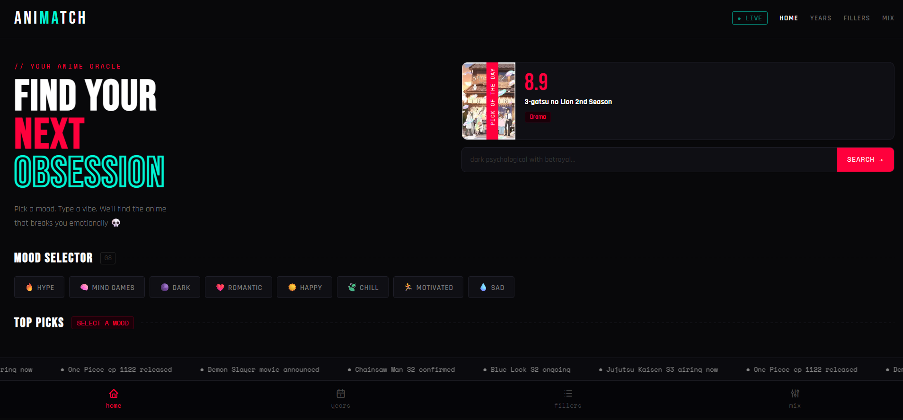
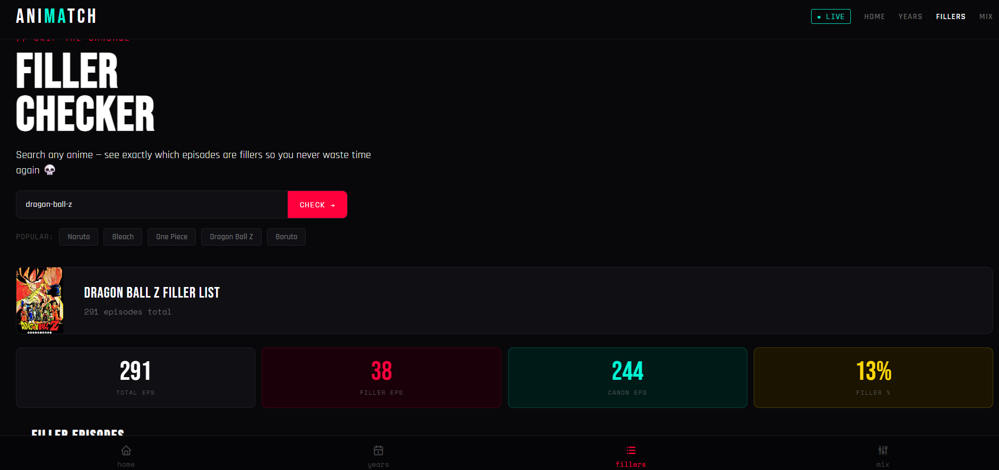
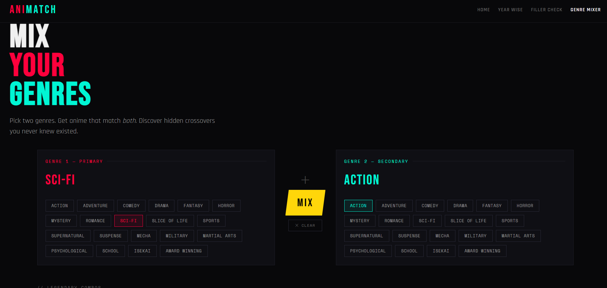

```
                                                                                
  █████╗ ███╗   ██╗██╗███╗   ███╗ █████╗ ████████╗ ██████╗██╗  ██╗
 ██╔══██╗████╗  ██║██║████╗ ████║██╔══██╗╚══██╔══╝██╔════╝██║  ██║
 ███████║██╔██╗ ██║██║██╔████╔██║███████║   ██║   ██║     ███████║
 ██╔══██║██║╚██╗██║██║██║╚██╔╝██║██╔══██║   ██║   ██║     ██╔══██║
 ██║  ██║██║ ╚████║██║██║ ╚═╝ ██║██║  ██║   ██║   ╚██████╗██║  ██║
 ╚═╝  ╚═╝╚═╝  ╚═══╝╚═╝╚═╝     ╚═╝╚═╝  ╚═╝   ╚═╝    ╚═════╝╚═╝  ╚═╝
                                                                                
        PICK A MOOD  ·  MIX A GENRE  ·  SKIP THE FILLER  ·  WATCH SOMETHING
```

> **A dark, chaotic anime discovery engine — mood search, genre mixing, and filler detection, powered by real MyAnimeList data. Zero backend, zero sign-up.**

[](https://animatch-hazel.vercel.app/)
[](https://developer.mozilla.org/en-US/docs/Web/HTML)
[](https://developer.mozilla.org/en-US/docs/Web/CSS)
[](https://developer.mozilla.org/en-US/docs/Web/JavaScript)
[](https://jikan.moe)
[](LICENSE)

---

## Preview


*Home — mood selector, Anime of the Day, free-text vibe search, and a scrolling live ticker*


*Filler Checker — total/canon/filler episode breakdown for any long-running series*


*Genre Mixer — pick two genres, get anime that satisfy both*

---

## What It Does

AniMatch is a static, multi-page anime discovery site built with vanilla HTML, CSS, and JavaScript — no framework, no build step, no backend. It exists because finding what to watch is harder than it should be: genre filters don't capture *mood*, long-running shows hide hundreds of filler episodes, and most "recommended for you" engines are a black box.

AniMatch fixes that with four focused tools. Mood-based search maps natural-language vibes ("dark psychological with betrayal") to real anime via the **Jikan API** (an unofficial MyAnimeList REST wrapper, no key required). The **Filler Checker** cross-references a self-scraped local dataset to tell you exactly which episodes to skip. The **Genre Mixer** finds anime satisfying two genres at once. And **Year-Wise Rankings** let you browse the best of any year from 1990 to 2026, live-airing shows included.

Every page is fully responsive and runs entirely client-side — open `index.html` and it works.

---

## Features

### Mood-Based Search

Type how you feel instead of picking from a genre dropdown — `"sad at 3am"`, `"brain off only fights"`, `"main character energy"`. A keyword-to-mood map translates free text into genre-weighted Jikan queries, falling back to a direct title search if nothing matches. The homepage also surfaces a daily **Anime of the Day**, deterministically picked from the current Top 25 so every visitor sees the same pick on a given day.

### Filler Checker

Search any long-running series and get a full breakdown: total episodes, canon count, filler count, and filler percentage — plus filler episodes grouped into readable ranges (`EP 26`, `EP 97–220`) with mixed canon/filler episodes flagged separately. Skip advice is generated from the filler ratio. Data comes from a one-time scrape of animefillerlist.com, cached locally so the page never depends on a live scraper.

### Genre Mixer

Select a primary and secondary genre from two independent panels and the mixer queries Jikan's genre-intersection parameters, ranked by score with pagination support. Ten "legendary combo" presets (Dark Fantasy, Space Horror, Mecha War, and more) auto-fill both panels and run instantly for one-click discovery.

### Year-Wise Rankings

Step through any year from 1990 to 2026 with arrow navigation or quick-jump buttons. Each year renders a gold/silver/bronze podium for the top 3, followed by a full top 10 list with posters, scores, and genres. For 2025–2026, the query end date is set to today so currently airing anime are correctly included.

### Chaotic, Intentional Design

Dark theme (`#08080a`), high-contrast accent palette (red `#ff003c`, teal `#00f5d4`, yellow `#ffd60a`), and a deliberately broken grid — staggered cards, a scrolling news ticker, and a live status badge — built with Bebas Neue, Rajdhani, and Space Mono.

---

## Why AniMatch?

| Feature | AniMatch | MyAnimeList | AniList | Anime-Planet |
|---|:---:|:---:|:---:|:---:|
| Runs with zero sign-up | ✅ | ❌ | ❌ | ❌ |
| Mood-based natural language search | ✅ | ❌ | ❌ | ❌ |
| Dedicated filler episode breakdown | ✅ | ❌ | ❌ | ❌ |
| Two-genre intersection mixer | ✅ | ❌ Single genre only | ❌ Single genre only | ❌ Single genre only |
| Year-wise podium rankings | ✅ | ⚠️ Buried in filters | ⚠️ Buried in filters | ❌ |
| No backend / no database | ✅ | ❌ | ❌ | ❌ |
| Free & open source | ✅ | ❌ Proprietary | ❌ Proprietary | ❌ Proprietary |
| Works offline after first load* | ✅ | ❌ | ❌ | ❌ |

<sub>*Static assets only — live anime data still requires a Jikan API call.</sub>

The gap AniMatch fills: **fast, opinionated discovery tools** for specific, recurring frustrations — not another general-purpose tracker with a recommendation tab bolted on.

---

## Tech Stack

| | Purpose |
|---|---|
| [](https://developer.mozilla.org/en-US/docs/Web/HTML) | Page structure, 4 standalone routes |
| [](https://developer.mozilla.org/en-US/docs/Web/CSS) | Modular stylesheets, custom properties, responsive breakpoints |
| [](https://developer.mozilla.org/en-US/docs/Web/JavaScript) | Fetch-based API calls, DOM rendering, no framework |
| [](https://jikan.moe) | Live anime data — scores, posters, genres, airing dates |
| [](https://python.org) | One-time filler data scraper (`scraper.py`) |
| [](https://vercel.com) | Static hosting, zero-config deploy |
| Bebas Neue · Rajdhani · Space Mono | Display, body, and monospace fonts via Google Fonts |

---

## Project Structure

```
animatch/
├── index.html              # Home — mood search, Anime of the Day, top 5
├── filler.html               # Filler Checker
├── yearwise.html               # Year-Wise Rankings
├── genres.html                   # Genre Mixer
│
├── css/
│   ├── style.css        → entry point, imports everything below
│   ├── base.css          → resets, CSS variables, global type
│   ├── nav.css            → navbar
│   ├── home.css            → homepage styles
│   ├── filler.css           → filler checker styles
│   ├── yearwise.css          → year rankings styles
│   ├── genres.css             → genre mixer styles
│   └── mobile.css              → responsive breakpoints
│
├── js/
│   ├── app.js          → homepage logic (search, mood mapping, AOTD)
│   ├── filler.js         → filler checker logic
│   ├── yearwise.js        → year-wise ranking logic
│   └── genres.js           → genre mixer logic
│
├── data/
│   └── fillers.json     → scraped filler dataset (20 series)
│
├── assets/                  # screenshots, logo
├── scraper.py                 # one-time filler.json scraper (already run)
└── README.md
```

---

## Quick Start

**Prerequisites:** A web browser. That's the entire list.

### 1. Clone

```bash
git clone https://github.com/aruu28249-boop/animatch.git
cd animatch
```

### 2. Run

Open `index.html` directly in your browser — or, for a local dev server:

```bash
npx serve .
```

No `npm install`, no `.env`, no API key. Jikan is a public, unauthenticated API.

---

## Data Sources

| What | Source | Method |
|---|---|---|
| Anime info, scores, posters, airing dates | [Jikan API v4](https://jikan.moe) | Live REST calls, no key required |
| Filler episode breakdown | [animefillerlist.com](https://www.animefillerlist.com/) | Scraped once via `scraper.py`, cached in `data/fillers.json` |

> Jikan enforces a public rate limit (3 req/sec, 60 req/min). Comfortable for normal traffic — worth knowing if this gets a sudden spike.

---

## Deploy to Vercel

AniMatch is a static site — Vercel deploys it in one step with zero configuration.

### 1. Push to GitHub

```bash
git push origin main
```

### 2. Connect to Vercel

1. Go to [vercel.com](https://vercel.com) → **Add New** → **Project** → import your repo
2. No build command needed — Vercel serves the static files as-is
3. Click **Deploy** — live in under a minute

> Every subsequent `git push` auto-redeploys. No environment variables required.

---

## Roadmap

### Shipped

- [x] Mood-based search with keyword-to-genre mapping and title-search fallback
- [x] Daily deterministic Anime of the Day
- [x] Filler Checker with episode-range grouping and skip advice
- [x] Genre Mixer with two-genre intersection and 10 legendary combo presets
- [x] Year-Wise Rankings (1990–2026) with podium + full top 10, live-airing support
- [x] Fully modular CSS architecture (8 files, single import entry point)
- [x] Full mobile responsiveness across all 4 pages
- [x] Scrolling live ticker, staggered chaotic card grid, dark theme

### In Progress / Near-term

- [ ] Improve mood → genre keyword matching accuracy
- [ ] Add loading skeletons instead of plain "loading" text
- [ ] Cache recent Jikan responses client-side to reduce repeat calls

### Future

- [ ] AI-assisted recommendation engine
- [ ] Trailer integration on anime detail hover
- [ ] User profiles and watch history (would require backend)
- [ ] "Hidden gems" discovery mode — surface low-popularity, high-score anime
- [ ] Explainable recommendations — show *why* a result was suggested
- [ ] Voice-based search input

---

## License

MIT License — see [LICENSE](LICENSE) for details.

---

## Acknowledgements

- Anime data from [Jikan API v4](https://jikan.moe) — unofficial MyAnimeList REST API
- Filler episode data sourced from [animefillerlist.com](https://www.animefillerlist.com/)
- Fonts: [Bebas Neue](https://fonts.google.com/specimen/Bebas+Neue), [Rajdhani](https://fonts.google.com/specimen/Rajdhani), [Space Mono](https://fonts.google.com/specimen/Space+Mono)
- Hosted on [Vercel](https://vercel.com)

---

<div align="center">

**If this saved you 40 minutes of scrolling, drop a ⭐ — it helps people find the project.**

</div>